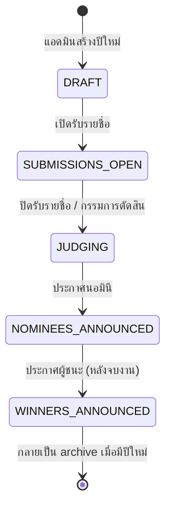
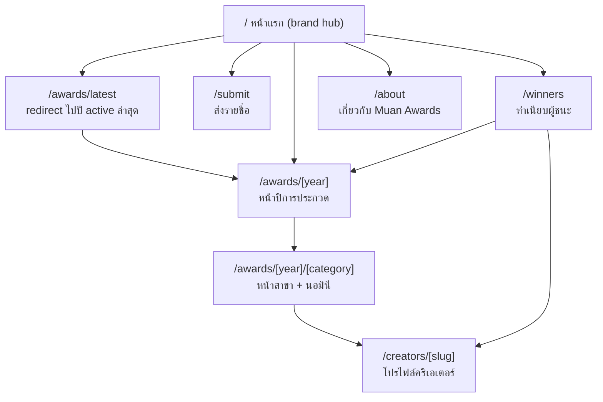
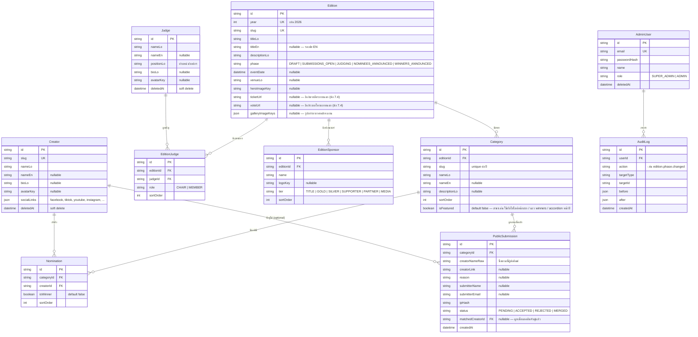

# PRD — เว็บไซต์ Muan Awards

| | |
|---|---|
| **เวอร์ชัน** | 0.4 (เพิ่ม Brand & Design Tokens จากไฟล์โลโก้จริง) |
| **วันที่** | 13 สิงหาคม 2026 |
| **เจ้าของโปรเจกต์** | Muan (Business Unit, Bizgital) |
| **สถานะ** | รอรีวิว — ยังไม่เริ่มพัฒนา |

---

## 1. ภาพรวมโครงการ

**Muan** เป็น business unit ที่ทำคอนเทนต์สาย entertainment ของประเทศลาว ผ่าน Facebook Page และเว็บไซต์ ในแต่ละปี Muan จัดงานออฟไลน์ **"Muan Awards"** เพื่อมอบรางวัลประจำปีให้แก่ครีเอเตอร์ลาวในสาขาต่างๆ โดยมีเกณฑ์การตัดสินและคณะกรรมการผู้ทรงคุณวุฒิเป็นผู้ลงคะแนนตัดสินผู้ชนะ

**ปัญหาที่ต้องแก้:** ปัจจุบันยังไม่มีเว็บไซต์กลางที่ (1) เก็บประวัติผู้ชนะแต่ละปีอย่างถาวร (2) ให้ข้อมูลงานปีปัจจุบัน และ (3) เปิดรับรายชื่อจากคนทางบ้าน — และที่สำคัญคือ **ต้องไม่ต้องสร้างเว็บใหม่ทุกปี** ทุกอย่างของปีถัดไปต้องจัดการได้ผ่านระบบหลังบ้านทั้งหมด

**Reference ด้านโครงสร้างและประสบการณ์ใช้งาน:** เว็บไซต์ Grammy Awards (grammy.com) — โดยเฉพาะการแยก "ปี" ออกจากกันชัดเจน, หน้ารวมสาขา/นอมินี, และ archive ผู้ชนะย้อนหลัง

**บทเรียนจากเว็บเวอร์ชันปัจจุบัน (muanawards.com):** เวอร์ชันปัจจุบันออกแบบธีม/โทนของทั้งเว็บตามงานแต่ละปี และนำข้อมูลงานปีล่าสุดมาแสดงเต็มหน้าแรก — เวอร์ชันใหม่จะ **กลับทิศทาง** เป็นแบบ grammy.com คือ ตัวเว็บมีดีไซน์กลางที่ไม่ผูกกับปีใดปีหนึ่ง (timeless) หน้าแรกทำหน้าที่เป็น brand hub ให้ข้อมูลภาพรวม ส่วนอัตลักษณ์/key visual ของงานแต่ละปีจะแสดงเฉพาะภายในหน้าของปีนั้นเท่านั้น

### กระบวนการจัดงานในแต่ละปี

1. Muan ตั้งค่าปีการประกวดและกำหนดสาขารางวัล
2. เปิดให้คนทางบ้านส่งรายชื่อครีเอเตอร์ที่อยากเสนอเข้าชิง พร้อมเลือกสาขา
3. ทีมงานคัดกรองรายชื่อ แล้วประกาศนอมินีของแต่ละสาขา
4. คณะกรรมการลงคะแนน (ทำนอกระบบเว็บ)
5. ประกาศผู้ชนะในงานออฟไลน์ แล้วอัปเดตผลบนเว็บไซต์
6. ปีถัดไปเริ่มวงจรใหม่ — ข้อมูลปีเก่ากลายเป็น archive อัตโนมัติ

---

## 2. เป้าหมายและตัวชี้วัด

### เป้าหมาย

- เป็น **แหล่งข้อมูลทางการ (single source of truth)** ของ Muan Awards ทุกปี
- เปิดรับรายชื่อจากสาธารณะได้จริง ใช้งานง่ายบนมือถือ
- ทีมงานจัดการปีใหม่ได้เองทั้งหมดผ่านหลังบ้าน **โดยไม่ต้องพึ่ง developer**
- สร้างความน่าเชื่อถือให้รางวัล ผ่านหน้าคณะกรรมการและ archive ที่ดูเป็นมืออาชีพ

### ตัวชี้วัดความสำเร็จ (ปีแรก)

| ตัวชี้วัด | เป้าหมาย |
|---|---|
| ทีมงานสร้างปีใหม่ + สาขาได้เองโดยไม่แก้โค้ด | 100% ของ workflow |
| จำนวนรายชื่อที่ส่งเข้ามาช่วงเปิดรับ | ตามเป้าแคมเปญของทีม content |
| เวลาที่ใช้อัปเดตผู้ชนะหลังประกาศในงาน | ภายในคืนวันงาน |
| เว็บโหลดเร็วบนมือถือ (4G) | LCP < 2.5s |

---

## 3. ผู้ใช้งาน (User Types)

| ผู้ใช้ | คือใคร | ทำอะไรบนเว็บ |
|---|---|---|
| **ผู้ชมทั่วไป** | คนลาวที่ติดตามวงการครีเอเตอร์ ส่วนใหญ่มาจากลิงก์บน Facebook ผ่านมือถือ | ดูนอมินี/ผู้ชนะ, ดูข้อมูลงาน, ดูย้อนหลัง |
| **ผู้เสนอชื่อ (Submitter)** | ผู้ชมที่อยากเสนอชื่อครีเอเตอร์ | กรอกฟอร์มส่งรายชื่อ + เลือกสาขา (ไม่ต้องสมัครสมาชิก) |
| **แอดมิน (ทีม Muan)** | ทีมงานขนาดเล็ก ทุกคนสิทธิ์เท่ากัน | จัดการทุกอย่างผ่านหลังบ้าน |

> **หมายเหตุ:** คณะกรรมการ **ไม่มี** บัญชีในระบบ — การโหวตทำนอกระบบ แอดมินเป็นผู้บันทึกผลเข้าเว็บ

---

## 4. วงจรของปีการประกวด (Edition Lifecycle)

หัวใจของระบบคือ "ปี" (Edition) แต่ละปีมี **เฟส (phase)** เป็นตัวกำหนดว่าเว็บ public แสดงอะไร และฟอร์มส่งรายชื่อเปิดหรือปิด แอดมินเป็นผู้กดเปลี่ยนเฟสจากหลังบ้าน

เฟสมีผลกับ 3 จุด: **หน้าปีการประกวด** (เนื้อหาหลักของเฟสอยู่ที่นี่), **ฟอร์มส่งรายชื่อ**, และ **แถบสถานะเล็กๆ บนหน้าแรก** (หน้าแรกไม่แสดงรายละเอียดงานปีปัจจุบัน — ดูข้อ 6.0)

| เฟส | หน้าปีการประกวด `/awards/[year]` แสดง | ฟอร์มส่งรายชื่อ | แถบสถานะบนหน้าแรก |
|---|---|---|---|
| `DRAFT` | ยังไม่เผยแพร่ (เข้าไม่ได้) | ปิด | ไม่แสดง |
| `SUBMISSIONS_OPEN` | ข้อมูลงาน + สาขาทั้งหมด + กรรมการ + CTA ส่งรายชื่อ | **เปิด** — ดึงสาขาของปีนี้มาให้เลือก | "เปิดรับเสนอชื่อแล้ว" → ลิงก์ไปฟอร์ม |
| `JUDGING` | ข้อมูลงาน + สาขา + "ปิดรับรายชื่อแล้ว อยู่ระหว่างการตัดสิน" | ปิด | ลิงก์ไปหน้าปีปัจจุบัน |
| `NOMINEES_ANNOUNCED` | รายชื่อนอมินีทุกสาขา + นับถอยหลังวันงาน | ปิด | "ประกาศนอมินีแล้ว" → ลิงก์ไปหน้าปี |
| `WINNERS_ANNOUNCED` | ผู้ชนะทุกสาขา (ไฮไลต์) + นอมินีร่วมสาขา | ปิด | "ประกาศผลแล้ว" → ลิงก์ไปหน้าปี |

**กฎสำคัญ:** เมนู "ปีปัจจุบัน", แถบสถานะหน้าแรก และฟอร์มส่งรายชื่อ ดึงข้อมูลจาก "ปีที่ active ล่าสุด" อัตโนมัติเสมอ — ไม่มีการ hardcode ปีในโค้ด

---

## 5. ขอบเขต

### MVP (เฟสแรก — ต้องมี)

- เว็บ public ภาษาลาว ครบทุกหน้าตาม sitemap ข้อ 6
- ระบบหลังบ้านครบ workflow: สร้างปี → สาขา → รับรายชื่อ → คัดนอมินี → บันทึกผู้ชนะ
- คลังครีเอเตอร์ + คลังกรรมการ ใช้ซ้ำข้ามปีได้
- ฟอร์มส่งรายชื่อ public พร้อมกันสแปมพื้นฐาน
- โครงสร้างข้อมูลรองรับภาษาอังกฤษ (เก็บ field แยกไว้ แต่ยังไม่เปิดสลับภาษา)

### เฟสถัดไป (ยังไม่ทำใน MVP)

- เปิดใช้ภาษาอังกฤษ + language switcher
- หน้า ข่าว/บทความ ของงาน
- ระบบโหวตกรรมการในเว็บ (ถ้าในอนาคตต้องการ)
- Public voting / popular vote (ถ้ามีสาขาที่ให้คนทางบ้านโหวต)
- สถิติ/insight ของการส่งรายชื่อแบบ realtime สำหรับทีม content

### นอกขอบเขตถาวร

- ระบบขายบัตรงาน, ระบบสมาชิกฝั่ง public

---

## 6. แนวทางการออกแบบ, Sitemap และรายละเอียดแต่ละหน้า

### 6.0 ทิศทางการออกแบบ (Design Direction)

ตกลงร่วมกับทีมแล้วว่าเวอร์ชันใหม่ใช้แนวทางแบบ grammy.com:

1. **โทนเว็บเป็นกลาง ไม่ผูกกับปี (timeless & neutral)** — palette, typography และ layout ของทั้งเว็บเป็นดีไซน์กลางของแบรนด์ Muan Awards ใช้ได้ทุกปีโดยไม่ต้องรื้อ ธีมไม่หวือหวา เน้นความน่าเชื่อถือแบบสถาบันรางวัล
2. **อัตลักษณ์รายปีอยู่ในหน้าปีเท่านั้น** — key visual / poster / โทนสีของงานแต่ละปี แสดงผ่าน `heroImageKey` และรูปประกอบภายใน `/awards/[year]` ของปีนั้น ไม่ลามมาเปลี่ยนธีมทั้งเว็บ
3. **หน้าแรก = brand hub ไม่ใช่หน้างานปีปัจจุบัน** — ให้ข้อมูลว่า Muan Awards คืออะไร + ไฮไลต์สิ่งที่ผ่านมา (เช่น ผู้ชนะปีล่าสุด, ตัวเลขสะสม) ส่วนงานปีปัจจุบันมีเพียง **แถบสถานะ/การ์ดเล็กๆ 1 จุด** ที่พาไปหน้าปีนั้น ไม่ประโคมรายละเอียดทั้งหมดลงหน้าแรก
4. **ทางเข้าสู่ปีปัจจุบันชัดเจนเสมอ** — เมนูหลักมีรายการ "Muan Awards [ปีล่าสุด]" ที่ชี้ไป `/awards/latest` (redirect ไปปีที่ active ล่าสุดอัตโนมัติ)

#### 6.0.1 ข้อค้นพบจากการสำรวจ (13 ส.ค. 2026)

สำรวจจริงด้วย browser: grammy.com (หน้าแรก, หน้าปี 68th Annual Grammy Awards, หน้า Awards History) และ muanawards.com (หน้าแรก, หน้า 2024)

**Pattern จาก grammy.com ที่นำมาใช้:**

- หน้าแรกเป็น brand hub จริง — งานปีปัจจุบันปรากฏแค่ใน nav และการ์ดทางเข้าใน hero เท่านั้น เนื้อหาที่เหลือเป็นเรื่องแบรนด์/องค์กร โทนสีกลางทั้งเว็บ
- Hero หน้าแรกมี **การ์ดทางเข้า 2 ใบ** (archive ผู้ชนะ + งานรอบปัจจุบัน/ถัดไป)
- หน้าปีมี **แถบเลือกปีแบบ pill แนวนอน** สลับดูปีอื่นได้ทันทีใน URL pattern เดียวกัน
- การนำเสนอสาขา: accordion ต่อสาขา — **การ์ดผู้ชนะแยกไฮไลต์** (พื้นหลังต่างสี + ป้าย "Winner") นำหน้า grid การ์ดนอมินี
- **ตารางสรุปผู้ชนะทุกสาขา** (สาขา | ผู้ชนะ | ลิงก์นอมินี) ให้สแกนผลรวมได้เร็ว
- หน้า archive เป็น **แถวต่อปี**: รูป key visual + ชื่องาน + ผู้ชนะสาขาใหญ่ + ปุ่มไปหน้าปี

**สิ่งที่เลิกทำจากเว็บเวอร์ชันปัจจุบัน:**

- ธีมรายปี (galaxy 2025) ครอบทั้งเว็บ และเอางานปีปัจจุบันลงหน้าแรกทั้งหมด
- ผู้ชนะ/กรรมการแสดงเป็นภาพกราฟิกโพสต์โซเชียล — เปลี่ยนเป็นการ์ดจากฐานข้อมูล (ค้นได้ แชร์รายสาขาได้ สะสมเป็นประวัติครีเอเตอร์)
- archive แบบหน้าเดียว ("our-projects") — เปลี่ยนเป็นโครงสร้างปีจริงตาม sitemap
- เมนู Voting / Ticket ค้างใน nav หลักตลอดปี — เปลี่ยนเป็นปุ่มรายปีในหน้าปี (ดูข้อ 7.4)
- หน้า FAQ แยก — รวมเนื้อหาเข้า `/about`

**สิ่งที่เก็บไว้ (ย้ายตำแหน่ง):** เนื้อหา "Muan Awards คืออะไร" (→ หน้าแรกแบบย่อ + `/about`), section กิจกรรมในงาน / กรรมการ / สปอนเซอร์แบบ tier / แกลเลอรีรูปงาน (→ ทั้งหมดอยู่ในหน้าปี)

#### 6.0.2 Brand & Design Tokens

**โลโก้** — ไฟล์ต้นฉบับอยู่ที่ `docs/assets/logos/` (รายละเอียดแต่ละแบบดู README ในโฟลเดอร์นั้น) มี 4 lockup × 3 สี:

| Lockup | ใช้ที่ไหน |
|---|---|
| `horizontal-*` | Nav bar (desktop), footer |
| `brandmark-*` | Nav bar (mobile), favicon/app icon |
| `main-*` | OG image, หน้า about |
| `wordmark-*` | ใช้เมื่อ brandmark ปรากฏอยู่แล้วในบริบทเดียวกัน |

เลือกสีตามพื้นหลัง: `-black` บนพื้นอ่อน, `-white` บนพื้นเข้ม, `-full-color` เฉพาะจุดที่ต้องการเน้น (OG image, hero)

**สีแบรนด์** — โทน holographic ชมพู-ม่วงของโลโก้เป็น **สีแบรนด์ถาวรของ Muan Awards** (ไม่ใช่ art direction รายปี) จึงเป็นฐานของ palette กลาง ค่าที่สกัดจากไฟล์โลโก้จริง:

| จุดยึด | Hex | ที่มา |
|---|---|---|
| Brand Pink | `#F9B8D5` | ปลายชมพูของ gradient |
| Brand Magenta | `#E897C9` | สีที่พบมากที่สุดในโลโก้ (จุดยึดหลัก) |
| Brand Violet | `#C896D8` | ปลายม่วงของ gradient |

**Gradient แบรนด์:** `Brand Pink → Brand Magenta → Brand Violet` (แนว 135°) ใช้กับ hero accent, ป้ายผู้ชนะ, เส้นคั่น — ไม่ใช้เป็นพื้นหลังเต็มหน้า (นั่นคือสิ่งที่เว็บเดิมทำแล้วเราเลิก)

**Color ramp สำหรับ UI** — สีจุดยึดทั้งสามสว่างเกินกว่าจะใช้เป็นตัวอักษร/ปุ่มบนพื้นขาวได้ (contrast ต่ำกว่า 2.4:1) จึงต้องมี ramp ที่เข้มขึ้นในเฉดเดียวกัน ค่าที่ผ่าน WCAG แล้ว:

| Token | Hex | Contrast บนขาว | ใช้กับ |
|---|---|---|---|
| `magenta-500` | `#D345A9` | 4.04:1 | พื้นปุ่ม/ป้าย (ตัวอักษรสีขาวบนนี้ได้) |
| `magenta-600` | `#BA2C8F` | 5.46:1 | ปุ่มหลัก, ลิงก์ (ผ่าน AA) |
| `magenta-700` | `#952373` | 7.59:1 | ตัวอักษรเน้น, hover ของปุ่มหลัก |
| `violet-600` | `#8D3EA8` | 6.20:1 | สีรอง (secondary action) |
| `magenta-200` | `#F0C1E2` | — | พื้นหลังไฮไลต์การ์ดผู้ชนะ, เส้นขอบ |
| `magenta-50` | `#FBEEF7` | — | พื้นหลัง section อ่อนๆ |

**Neutral** — Ink `#1A161E` (17.84:1 บนขาว) เป็นสีตัวอักษรหลักและพื้นหลังส่วนเข้ม (footer, section แบรนด์) — เป็นดำอมม่วงเล็กน้อยให้เข้ากับ palette ไม่ใช่ดำสนิท

**กฎการใช้สี:**

1. โครงหลักของเว็บเป็น **neutral (ขาว/ink)** — สีแบรนด์ใช้เป็น accent ไม่ใช่พื้นหลังหลัก ตามข้อ 6.0.1
2. ข้อความทุกจุดต้องผ่าน **WCAG AA (4.5:1)** — ห้ามใช้สีจุดยึดทั้งสามเป็นสีตัวอักษรบนพื้นขาว
3. สีของ key visual รายปีอยู่ในกรอบรูปภาพเท่านั้น ไม่ override token เหล่านี้

**Typography** — ตามข้อ 9: Noto Sans Lao (เนื้อหาลาว) + DM Sans (ตัวเลข/ละติน)

**ข้อจำกัดของ asset ปัจจุบัน (ยอมรับแล้ว เริ่มพัฒนาไปก่อนได้):**

- มีแต่ PNG ยังไม่มีไฟล์เวกเตอร์ — เริ่มด้วย PNG ไปก่อน แล้วเปลี่ยนเป็น SVG ทีหลังเมื่อทีมกราฟิกส่งมา
- favicon ต้องใช้ brandmark เวอร์ชันย่อ (ลายเส้นปัจจุบันละเอียดเกินไปที่ 32×32 px) — ขอทีหลัง

### 6.1 เว็บ Public — 7 หน้า

| # | หน้า | Route | เนื้อหาหลัก |
|---|---|---|---|
| 1 | **หน้าแรก (brand hub)** | `/` | ดีไซน์กลาง ไม่ผูกกับปี — layout ละเอียดดูข้อ 6.1.1 |
| 2 | **หน้าปีการประกวด** | `/awards/[year]` (+ `/awards/latest` redirect ไปปี active ล่าสุด) | **เนื้อหาหลักของงานปีนั้นทั้งหมด** — เนื้อหาปรับตามเฟส (ตารางข้อ 4), layout ละเอียดดูข้อ 6.1.2 |
| 3 | **หน้าสาขา** | `/awards/[year]/[category]` | รายละเอียดสาขา, การ์ดนอมินีทุกคน (ผู้ชนะถูกไฮไลต์เมื่อประกาศแล้ว) — แยกหน้าเพื่อให้แชร์ลง Facebook รายสาขาได้ |
| 4 | **ส่งรายชื่อ** | `/submit` | ฟอร์ม public (รายละเอียดข้อ 7.1) — ถ้าไม่อยู่ในเฟสเปิดรับ แสดงข้อความสถานะแทนฟอร์ม |
| 5 | **ทำเนียบผู้ชนะ** | `/winners` | Archive ผู้ชนะทุกปี (แบบ "The Grammy Archive") — layout ละเอียดดูข้อ 6.1.3 |
| 6 | **โปรไฟล์ครีเอเตอร์** | `/creators/[slug]` | รูป, bio, ช่องทาง social, **ประวัติการเข้าชิงและรางวัลที่เคยได้ทุกปี** (สร้างอัตโนมัติจากข้อมูล Nomination) |
| 7 | **เกี่ยวกับงาน** | `/about` | ที่มาของ Muan Awards, เกณฑ์/กระบวนการตัดสิน, FAQ (รวมจากเว็บเดิม), ช่องทางติดต่อ/สปอนเซอร์ |

> คณะกรรมการเป็น **section ในหน้าปี** (ไม่แยกหน้า) เพราะเนื้อหาต่อคนสั้น — ถ้าอนาคตกรรมการมี bio ยาวขึ้นค่อยแยกหน้าได้

#### 6.1.1 Layout หน้าแรก (brand hub)

ลำดับ section บนหน้าแรก:

1. **Nav หลัก (กลาง ไม่ผูกปี)** — โลโก้ Muan Awards + เมนู: "Muan Awards [ปีล่าสุด]" (→ `/awards/latest`), ทำเนียบผู้ชนะ, เกี่ยวกับงาน + ปุ่ม CTA "ส่งรายชื่อ" (แสดงเฉพาะเฟส `SUBMISSIONS_OPEN`) — **ไม่มีเมนู Voting/Ticket** (ดูข้อ 7.4)
2. **Hero brand statement** — ข้อความแนะนำแบรนด์ + **การ์ดทางเข้า 2 ใบ**: (ก) การ์ดสถานะงานปีปัจจุบัน — หัวข้อ/CTA เปลี่ยนตามเฟส (ตารางข้อ 4) พร้อมลิงก์รอง "ซื้อบัตร"/"โหวต" เมื่อปีนั้นมี `ticketUrl`/`voteUrl` — นี่คือ "จุดเดียว" ของงานปีปัจจุบันบนหน้าแรกตามข้อ 6.0 (ข) การ์ด "ทำเนียบผู้ชนะ" (evergreen)
3. **"Muan Awards คืออะไร"** — เนื้อหาย่อจาก `/about` + ลิงก์อ่านต่อ
4. **ไฮไลต์ผู้ชนะปีล่าสุด** — การ์ดผู้ชนะจากสาขาเด่น (`Category.isFeatured`) 4–6 ใบ + ลิงก์ไปหน้าปี — แสดงเมื่อมีอย่างน้อย 1 ปีที่ `WINNERS_ANNOUNCED` และสลับเป็นปีใหม่อัตโนมัติ (ข้อ 7.3)
5. **ตัวเลขสะสม** — จำนวนปีที่จัด / สาขา / ครีเอเตอร์ (คำนวณจากข้อมูลจริง ไม่ hardcode)
6. **แถบ quick links** — ปีปัจจุบัน / ทำเนียบผู้ชนะ / เกณฑ์การตัดสิน (`/about`) / ส่งรายชื่อ
7. **Footer** — social links, ช่องทางติดต่อ, copyright

> หน้าแรก**ไม่มี section สปอนเซอร์** — สปอนเซอร์เป็นของรายปี แสดงในหน้าปีเท่านั้น

#### 6.1.2 Layout หน้าปี `/awards/[year]`

1. **Hero ของปี** — `heroImageKey` + ชื่องาน + วันที่/สถานที่ + **แถว CTA สูงสุด 3 ปุ่ม**: ปุ่มตามเฟส (เช่น "ส่งรายชื่อ"), "ซื้อบัตร" (เมื่อมี `ticketUrl`), "โหวต" (เมื่อมี `voteUrl`) — ปุ่มลิงก์ภายนอกใช้สไตล์รอง + icon external ให้ต่างจากปุ่ม action ในเว็บ — อัตลักษณ์รายปีจำกัดอยู่ในกรอบ hero/รูปประกอบ ไม่เปลี่ยนธีมส่วนอื่นของเว็บ
2. **แถบเลือกปี (pill แนวนอน)** — ทุก edition ที่ phase ≠ `DRAFT` เรียงใหม่ → เก่า, เลื่อนแนวนอนบนมือถือ
3. **สาขา + นอมินี (ตามเฟส)** — ก่อน `NOMINEES_ANNOUNCED`: รายการสาขาทั้งหมด (ชื่อ + คำอธิบาย); ตั้งแต่ `NOMINEES_ANNOUNCED`: **accordion ต่อสาขา** — สาขาเด่น (`isFeatured`) กางไว้ก่อน ภายในเป็น grid การ์ดนอมินี (รูป + ชื่อ) และเมื่อ `WINNERS_ANNOUNCED` การ์ดผู้ชนะแยกไฮไลต์ (พื้นหลังต่างสี + ป้าย "ผู้ชนะ") นำหน้า grid — ทุกสาขามีลิงก์ "ดูทั้งสาขา" → `/awards/[year]/[category]`
4. **ตารางสรุปผู้ชนะทุกสาขา** (เฉพาะ `WINNERS_ANNOUNCED`) — สาขา | ผู้ชนะ | ลิงก์ดูนอมินี — desktop เป็นตาราง, mobile ยุบเป็น list การ์ด
5. **กิจกรรมในงาน** — ข้อมูลงาน/กิจกรรม (carpet walk, การแสดง ฯลฯ)
6. **คณะกรรมการ** — การ์ดกรรมการ (รูป ชื่อ ตำแหน่ง) เรียงตาม `sortOrder` ประธานขึ้นก่อน
7. **สปอนเซอร์ของปี** — โลโก้จัดกลุ่มตาม tier (`EditionSponsor`)
8. **แกลเลอรีหลังจบงาน** — จาก `galleryImageKeys` (แสดงเมื่อมีรูป)

#### 6.1.3 Layout หน้า `/winners` (ทำเนียบผู้ชนะ)

รายการ**แถวต่อปี** เรียงใหม่ → เก่า — แต่ละแถว: รูป key visual ของปี (`heroImageKey`) + ชื่องาน/ปี + ผู้ชนะจากสาขาเด่น 3–4 สาขา + ปุ่ม "ดูผลทั้งหมด" → หน้าปีนั้น (ยังไม่ต้องมี filter ช่วงปี — ค่อยเพิ่มเมื่อจำนวนปีสะสมมากขึ้น)

### 6.2 หลังบ้าน (Admin) — 9 หน้า

Route ทั้งหมดอยู่ใต้ `/admin` และต้อง login

| # | หน้า | Route | ทำอะไรได้ |
|---|---|---|---|
| 1 | Login | `/admin/login` | เข้าสู่ระบบ (email + password) |
| 2 | Setup ครั้งแรก | `/admin/setup` | สร้างบัญชี Super Admin คนแรก (ปิดถาวรหลังใช้งาน) |
| 3 | Dashboard | `/admin` | สรุปสถานะปีปัจจุบัน: เฟส, จำนวนรายชื่อที่รอคัดกรอง, จำนวนนอมินีต่อสาขา, shortcut งานที่ค้าง |
| 4 | จัดการปี | `/admin/editions` + `/admin/editions/[id]` | สร้าง/แก้ไขปี, **ปุ่มเปลี่ยนเฟส**, จัดการภายในปีเป็น tab: ข้อมูลงาน / สาขา / นอมินี / กรรมการ / สปอนเซอร์ |
| 5 | คลังครีเอเตอร์ | `/admin/creators` | CRUD ครีเอเตอร์ (ชื่อ, รูป, bio, social links) — เป็นคลังกลางใช้ทุกปี |
| 6 | คลังกรรมการ | `/admin/judges` | CRUD กรรมการ (ชื่อ, รูป, ตำแหน่ง/องค์กร, bio) — ใช้ซ้ำข้ามปีได้ |
| 7 | คิวรายชื่อจากทางบ้าน | `/admin/submissions` | ดูรายชื่อที่ส่งเข้ามา **จัดกลุ่มตามชื่อ+สาขา พร้อมจำนวนครั้งที่ถูกส่ง**, กด "รับเป็นนอมินี" (ผูกเข้าคลังครีเอเตอร์) หรือปฏิเสธ |
| 8 | ผู้ใช้หลังบ้าน | `/admin/users` | เพิ่ม/ลบบัญชีทีมงาน |
| 9 | Audit Log | `/admin/audit` | ประวัติการแก้ไขทั้งหมด (ใครทำอะไรเมื่อไหร่) |

**Flow สำคัญในหน้า `/admin/editions/[id]`:**

- **Tab สาขา** — เพิ่ม/เรียงลำดับ/แก้ไขสาขาของปีนั้น (สามารถ "คัดลอกสาขาจากปีก่อน" ได้ในคลิกเดียว)
- **Tab นอมินี** — เลือกสาขา → ค้นหาครีเอเตอร์จากคลัง (หรือสร้างใหม่ตรงนั้น) → เพิ่มเป็นนอมินี → ติ๊ก "ผู้ชนะ" ได้ 1 คนต่อสาขา
- **Tab กรรมการ** — เลือกกรรมการจากคลัง (หรือสร้างใหม่) + กำหนดบทบาท (ประธาน/กรรมการ) + เรียงลำดับการแสดงผล
- **Tab สปอนเซอร์** — CRUD สปอนเซอร์ของปีนั้น (ชื่อ, โลโก้, tier, ลำดับ)
- **Tab ข้อมูลงาน** ครอบคลุม: วันที่/สถานที่/คำอธิบาย, `heroImageKey`, ลิงก์ภายนอก `ticketUrl` / `voteUrl` (ข้อ 7.4), รูปแกลเลอรีหลังจบงาน (`galleryImageKeys`)

---

## 7. รายละเอียดฟีเจอร์สำคัญ

### 7.1 ฟอร์มส่งรายชื่อ (Public Submission)

| Field | จำเป็น | หมายเหตุ |
|---|---|---|
| ชื่อครีเอเตอร์ที่เสนอ | ✅ | Free text + autocomplete จากคลังครีเอเตอร์ (ช่วยลดชื่อสะกดต่างกัน) |
| สาขา | ✅ | Dropdown ดึงจากสาขาของปีที่เปิดรับอยู่ **อัตโนมัติ** |
| ลิงก์ช่องทางของครีเอเตอร์ | ⬜ | ช่วยทีมงานตามหาตัวได้เร็ว |
| เหตุผลที่เสนอ | ⬜ | Text สั้น |
| ชื่อ/อีเมลผู้ส่ง | ⬜ | ไม่บังคับ — ลด friction ตามที่ตกลง |

**กันสแปมพื้นฐาน:**

- Rate limit ต่อ IP (เช่น 10 ครั้ง/ชั่วโมง)
- Honeypot field (bot กรอก → ทิ้งเงียบๆ)
- ส่งซ้ำชื่อเดิม+สาขาเดิมจาก IP เดิมภายในวันเดียวกัน → นับเป็น 1
- เก็บ IP แบบ hash เพื่อความเป็นส่วนตัว

### 7.2 คิวคัดกรองรายชื่อ (Submission Queue)

- รายชื่อถูก **จัดกลุ่มอัตโนมัติ** ตาม (ชื่อที่ส่งมา + สาขา) พร้อมตัวเลขจำนวนครั้ง — ทีมเห็นทันทีว่าใครถูกเสนอเยอะ
- ปุ่มต่อกลุ่ม: **รับเป็นนอมินี** (จับคู่กับครีเอเตอร์ในคลัง หรือสร้างโปรไฟล์ใหม่) / **ปฏิเสธ** / **รวมกับกลุ่มอื่น** (กรณีสะกดต่างกันแต่เป็นคนเดียวกัน)
- สถานะของทุก submission ถูกเก็บไว้เป็นหลักฐาน ไม่ลบทิ้ง

### 7.3 หน้าปีแบบ Dynamic + หน้าแรกแบบ Evergreen

- **หน้าปีการประกวด** render ตาม `phase` ของ Edition นั้น — ไม่มีการตั้งเวลา/แก้โค้ด แอดมินกดเปลี่ยนเฟสแล้วเว็บเปลี่ยนทันที (ผ่าน revalidation ของ Next.js)
- **หน้าแรก** เป็น evergreen — เนื้อหาหลักไม่เปลี่ยนตามเฟส มีเพียง 2 จุดที่อัปเดตอัตโนมัติ: (1) แถบสถานะงานปีปัจจุบัน (2) ไฮไลต์ผู้ชนะจะสลับมาเป็นปีใหม่เองเมื่อปีนั้นเข้าเฟส `WINNERS_ANNOUNCED`
- `/awards/latest` redirect ไปยัง Edition ที่ active ล่าสุด (phase ≠ `DRAFT`) — ใช้เป็นลิงก์ในเมนูหลักและใช้แชร์ในแคมเปญได้โดยไม่ต้องแก้ลิงก์ทุกปี

### 7.4 ปุ่มลิงก์ภายนอกรายปี (ซื้อบัตร / โหวต)

การขายบัตรและ popular vote ของแต่ละปีใช้**ระบบภายนอก** (ปัจจุบัน: tickget.la และ muanawards.wevote.la) — เว็บเราเก็บเพียง URL ต่อปี

- Field: `Edition.ticketUrl` และ `Edition.voteUrl` (nullable ทั้งคู่)
- **กติกาแสดงผล: กรอก URL = ปุ่มแสดง, ล้าง URL = ปุ่มหาย** — แอดมินคุมช่วงเปิด/ปิดเองจากหลังบ้าน โดย**ไม่ผูกกับเฟส** (ช่วงขายบัตร/เปิดโหวตคาบเกี่ยวหลายเฟสและต่างกันในแต่ละปี)
- ตำแหน่งปุ่ม: (1) แถว CTA ใน hero ของหน้าปี (2) ลิงก์รองในการ์ดสถานะปีปัจจุบันบนหน้าแรก — **ไม่อยู่ใน nav หลัก** (nav ต้องเป็นของกลางที่ไม่ต้องแก้รายปี ต่างจากเว็บเดิมที่เมนู Voting/Ticket ค้างทั้งปี)
- ปีที่จบแล้วให้ล้าง URL ออก → ปุ่มหายจาก archive เอง ไม่เหลือลิงก์เน่า
- ไม่ขัดกับ "นอกขอบเขตถาวร: ระบบขายบัตร" (เป็นเพียงลิงก์ออก ไม่ใช่ระบบขายบัตรในเว็บ) และไม่ตัดโอกาสทำ "Public voting ในเว็บ" ตามแผนเฟสถัดไป

---

## 8. โครงสร้างฐานข้อมูล

หลักการออกแบบ: **แยกข้อมูลถาวร (คลัง) ออกจากข้อมูลรายปี (การ assign)** — Creator และ Judge สร้างครั้งเดียว ใช้ได้ทุกปี

### กติกาสำคัญของข้อมูล (Business Rules)

1. `Nomination` unique ต่อ (`categoryId`, `creatorId`) — ครีเอเตอร์คนเดียวเป็นนอมินีซ้ำในสาขาเดียวกันไม่ได้ (แต่เข้าชิงหลายสาขาในปีเดียวกันได้)
2. `isWinner = true` ได้ **สูงสุด 1 คนต่อสาขา** — บังคับที่ service layer
3. เปลี่ยนเฟสได้เฉพาะ "เดินหน้า" ตามลำดับ (ถอยหลังได้เฉพาะ Super Admin เผื่อกดพลาด — บันทึก audit log เสมอ)
4. ประวัติบนโปรไฟล์ครีเอเตอร์คำนวณจาก `Nomination` ทั้งหมด — ไม่เก็บซ้ำ
5. ทุก field เนื้อหามีคู่ `...Lo` / `...En` (En เป็น nullable) — เปิดภาษาอังกฤษภายหลังได้โดยไม่ต้อง migrate โครงสร้าง
6. การแก้ไขที่เปลี่ยนสถานะทุกอย่าง (สร้างปี, เปลี่ยนเฟส, ติ๊กผู้ชนะ, รับ/ปฏิเสธรายชื่อ) ต้องลง `AuditLog`
7. `Category.isFeatured` ควรมี 3–6 สาขาต่อปี (แนะนำที่ระดับ UI หลังบ้าน ไม่บังคับที่ DB) — ใช้กับไฮไลต์ผู้ชนะบนหน้าแรก, แถวใน `/winners` และ accordion ที่กางไว้ก่อนในหน้าปี
8. ปุ่ม "ซื้อบัตร"/"โหวต" แสดงเมื่อ `ticketUrl`/`voteUrl` ไม่ว่างเท่านั้น — ไม่ผูกกับเฟส (ข้อ 7.4)

---

## 9. สถาปัตยกรรมและ Tech Stack

ใช้ stack มาตรฐานของบริษัท:

| ส่วน | เทคโนโลยี |
|---|---|
| Frontend | Next.js (App Router) + Tailwind CSS v4 + shadcn/ui |
| Backend | NestJS + REST `/api/v1/` + Swagger |
| Database | MySQL + Prisma |
| Auth (admin เท่านั้น) | JWT + Refresh Token (HttpOnly cookie) |
| ไฟล์รูป (โลโก้, รูปครีเอเตอร์/กรรมการ, hero) | MinIO (local) / DigitalOcean Spaces (production) |
| Deploy | Docker Compose + Caddy |
| Font | Noto Sans Lao (เนื้อหาลาว) + DM Sans (ตัวเลข/ละติน) |

**ประเด็นเฉพาะของโปรเจกต์นี้:**

- หน้า public เป็น **Server Components + ISR/revalidation** — โหลดเร็ว, SEO ดี, และข้อมูลอัปเดตทันทีเมื่อแอดมินแก้หลังบ้าน (trigger revalidate)
- ไม่ต้องมี Redis/BullMQ ใน MVP — ไม่มีงาน async หนัก (ตัด worker ออกจาก docker-compose ได้ ลดความซับซ้อน) *(ยกเว้นเลือกใช้ rate limit แบบ distributed ในอนาคต)*
- SEO: meta/OG tags ต่อหน้า (แชร์หน้าสาขาลง Facebook แล้วขึ้นภาพ+ชื่อสาขาสวยๆ), sitemap.xml อัตโนมัติ

---

## 10. Non-Functional Requirements

| ด้าน | ข้อกำหนด |
|---|---|
| **Mobile-first** | ผู้ชมส่วนใหญ่มาจาก Facebook บนมือถือ — ทุกหน้า public ออกแบบ mobile ก่อน (ต่างจาก default ของ stack ที่ desktop-first ซึ่งใช้กับฝั่ง admin) |
| **Performance** | LCP < 2.5s บน 4G, รูปทุกรูปผ่าน next/image + ขนาดเหมาะสม |
| **ภาษา** | MVP = ลาวทั้งหมด, โครงสร้างพร้อม EN (field `...En` + i18n routing ที่เปิดทีหลังได้) |
| **Security** | Helmet, CORS whitelist, rate limiting, bcrypt, ฟอร์ม public มี honeypot |
| **Privacy** | ไม่บังคับเก็บข้อมูลส่วนตัวผู้ส่ง, IP เก็บแบบ hash |
| **Audit** | ทุก action ที่เปลี่ยนข้อมูลตรวจย้อนหลังได้ |
| **Timezone** | เก็บ UTC, แสดงผลเวลาลาว (Asia/Vientiane, UTC+7) |

---

## 11. คำถามที่ยังเปิดอยู่ (Open Questions)

ต้องได้คำตอบก่อน/ระหว่างเริ่มพัฒนา:

1. **โดเมน** — จะใช้โดเมนอะไร? (เช่น `awards.muan.la` หรือ `muanawards.com`) มีผลต่อการตั้งค่า SEO/OG ตั้งแต่แรก
2. ~~**แบรนด์ดิ้ง** — มีโลโก้ Muan Awards, สีแบรนด์ แล้วหรือยัง?~~ **ตอบแล้ว (13 ส.ค. 2026):** ได้โลโก้ครบ 4 lockup × 3 สี (`docs/assets/logos/`) และยืนยันว่าโทน holographic ชมพู-ม่วงเป็นสีแบรนด์ถาวร → สรุปเป็น design tokens ในข้อ 6.0.2 แล้ว **ค้างอยู่:** ไฟล์เวกเตอร์ (SVG/AI) และ brandmark เวอร์ชันย่อสำหรับ favicon — ขอทีหลัง ไม่บล็อกการพัฒนา
3. **สาขาปีแรกบนเว็บ** — จะเริ่มด้วยข้อมูลปีล่าสุดปีเดียว หรืออยากย้อนใส่ข้อมูลปีก่อนๆ ที่เคยจัดมาแล้วเข้า archive ด้วย? (ถ้าย้อน ต้องเตรียมรายชื่อผู้ชนะ+รูปเก่า)
4. **จำนวนสาขาโดยประมาณต่อปี** — มีผลต่อการออกแบบ layout หน้าปี (10 สาขา vs 30 สาขา หน้าตาไม่เหมือนกัน)
5. **รูปครีเอเตอร์** — ทีมมีสิทธิ์ใช้รูปครีเอเตอร์ไหม หรือจะใช้รูปโปรไฟล์จาก social ของเขา (ประเด็นลิขสิทธิ์/การขออนุญาต)
6. **ช่วงเวลาเปิดรับรายชื่อของปีนี้** — เพื่อวางแผน timeline การพัฒนาให้ทันแคมเปญ
7. **สาขาเด่น (`isFeatured`) ของปีล่าสุด** — จะเลือกสาขาไหนเป็นสาขาเด่น 3–6 สาขา (ใช้กับไฮไลต์หน้าแรก / แถว `/winners` / accordion หน้าปี) — ตอบตอนใส่ข้อมูลจริงได้

---

## 12. แผนงานถัดไป (หลัง PRD ผ่าน)

1. **Design** — ทำ wireframe/mockup หน้า public หลัก (หน้าแรก, หน้าปี, หน้าสาขา, ฟอร์ม) ตาม art direction ของแบรนด์
2. **Scaffold** — ตั้งโปรเจกต์ตาม stack มาตรฐาน + Prisma schema ตามข้อ 8
3. **พัฒนา Backend + Admin** — workflow หลังบ้านครบวงจรก่อน (เพราะเป็นเงื่อนไขของข้อมูลทุกหน้า)
4. **พัฒนาเว็บ Public** — ต่อ API จริง
5. **ใส่ข้อมูลจริง + UAT กับทีม Muan** — ทดลองสร้างปี + สาขา + นอมินีจริง
6. **Deploy production + ตั้งโดเมน**
