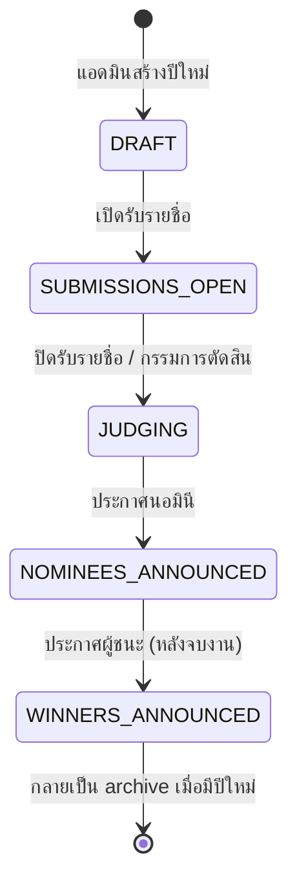
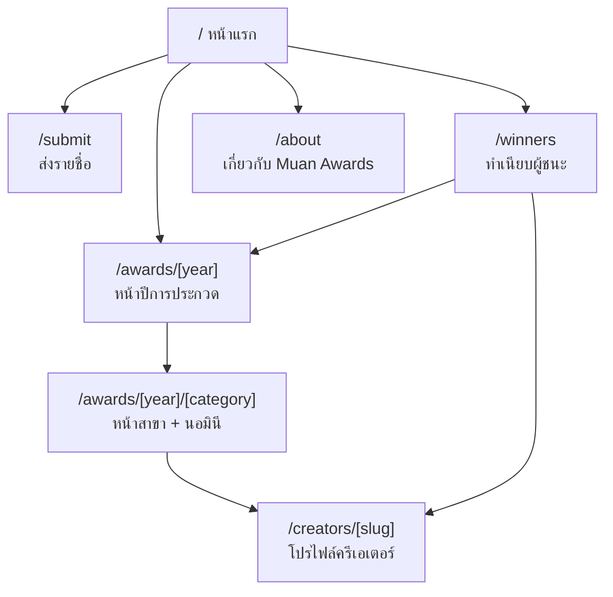
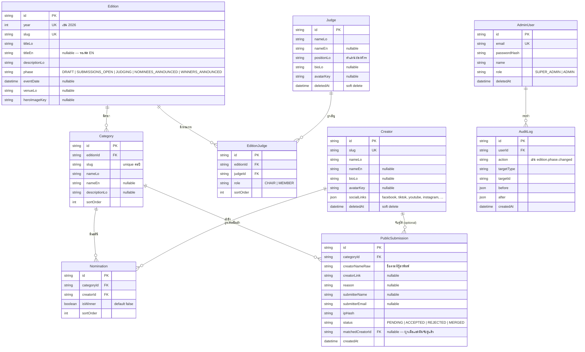

# PRD — เว็บไซต์ Muan Awards

| | |
|---|---|
| **เวอร์ชัน** | 0.1 (Draft สำหรับรีวิว) |
| **วันที่** | 11 สิงหาคม 2026 |
| **เจ้าของโปรเจกต์** | Muan (Business Unit, Bizgital) |
| **สถานะ** | รอรีวิว — ยังไม่เริ่มพัฒนา |

---

## 1. ภาพรวมโครงการ

**Muan** เป็น business unit ที่ทำคอนเทนต์สาย entertainment ของประเทศลาว ผ่าน Facebook Page และเว็บไซต์ ในแต่ละปี Muan จัดงานออฟไลน์ **"Muan Awards"** เพื่อมอบรางวัลประจำปีให้แก่ครีเอเตอร์ลาวในสาขาต่างๆ โดยมีเกณฑ์การตัดสินและคณะกรรมการผู้ทรงคุณวุฒิเป็นผู้ลงคะแนนตัดสินผู้ชนะ

**ปัญหาที่ต้องแก้:** ปัจจุบันยังไม่มีเว็บไซต์กลางที่ (1) เก็บประวัติผู้ชนะแต่ละปีอย่างถาวร (2) ให้ข้อมูลงานปีปัจจุบัน และ (3) เปิดรับรายชื่อจากคนทางบ้าน — และที่สำคัญคือ **ต้องไม่ต้องสร้างเว็บใหม่ทุกปี** ทุกอย่างของปีถัดไปต้องจัดการได้ผ่านระบบหลังบ้านทั้งหมด

**Reference ด้านโครงสร้างและประสบการณ์ใช้งาน:** เว็บไซต์ Grammy Awards (grammy.com) — โดยเฉพาะการแยก "ปี" ออกจากกันชัดเจน, หน้ารวมสาขา/นอมินี, และ archive ผู้ชนะย้อนหลัง

### กระบวนการจัดงานในแต่ละปี

1. Muan ตั้งค่าปีการประกวดและกำหนดสาขารางวัล
2. เปิดให้คนทางบ้านส่งรายชื่อครีเอเตอร์ที่อยากเสนอเข้าชิง พร้อมเลือกสาขา
3. ทีมงานคัดกรองรายชื่อ แล้วประกาศนอมินีของแต่ละสาขา
4. คณะกรรมการลงคะแนน (ทำนอกระบบเว็บ)
5. ประกาศผู้ชนะในงานออฟไลน์ แล้วอัปเดตผลบนเว็บไซต์
6. ปีถัดไปเริ่มวงจรใหม่ — ข้อมูลปีเก่ากลายเป็น archive อัตโนมัติ

---

## 2. เป้าหมายและตัวชี้วัด

### เป้าหมาย

- เป็น **แหล่งข้อมูลทางการ (single source of truth)** ของ Muan Awards ทุกปี
- เปิดรับรายชื่อจากสาธารณะได้จริง ใช้งานง่ายบนมือถือ
- ทีมงานจัดการปีใหม่ได้เองทั้งหมดผ่านหลังบ้าน **โดยไม่ต้องพึ่ง developer**
- สร้างความน่าเชื่อถือให้รางวัล ผ่านหน้าคณะกรรมการและ archive ที่ดูเป็นมืออาชีพ

### ตัวชี้วัดความสำเร็จ (ปีแรก)

| ตัวชี้วัด | เป้าหมาย |
|---|---|
| ทีมงานสร้างปีใหม่ + สาขาได้เองโดยไม่แก้โค้ด | 100% ของ workflow |
| จำนวนรายชื่อที่ส่งเข้ามาช่วงเปิดรับ | ตามเป้าแคมเปญของทีม content |
| เวลาที่ใช้อัปเดตผู้ชนะหลังประกาศในงาน | ภายในคืนวันงาน |
| เว็บโหลดเร็วบนมือถือ (4G) | LCP < 2.5s |

---

## 3. ผู้ใช้งาน (User Types)

| ผู้ใช้ | คือใคร | ทำอะไรบนเว็บ |
|---|---|---|
| **ผู้ชมทั่วไป** | คนลาวที่ติดตามวงการครีเอเตอร์ ส่วนใหญ่มาจากลิงก์บน Facebook ผ่านมือถือ | ดูนอมินี/ผู้ชนะ, ดูข้อมูลงาน, ดูย้อนหลัง |
| **ผู้เสนอชื่อ (Submitter)** | ผู้ชมที่อยากเสนอชื่อครีเอเตอร์ | กรอกฟอร์มส่งรายชื่อ + เลือกสาขา (ไม่ต้องสมัครสมาชิก) |
| **แอดมิน (ทีม Muan)** | ทีมงานขนาดเล็ก ทุกคนสิทธิ์เท่ากัน | จัดการทุกอย่างผ่านหลังบ้าน |

> **หมายเหตุ:** คณะกรรมการ **ไม่มี** บัญชีในระบบ — การโหวตทำนอกระบบ แอดมินเป็นผู้บันทึกผลเข้าเว็บ

---

## 4. วงจรของปีการประกวด (Edition Lifecycle)

หัวใจของระบบคือ "ปี" (Edition) แต่ละปีมี **เฟส (phase)** เป็นตัวกำหนดว่าเว็บ public แสดงอะไร และฟอร์มส่งรายชื่อเปิดหรือปิด แอดมินเป็นผู้กดเปลี่ยนเฟสจากหลังบ้าน

| เฟส | เว็บ public แสดง | ฟอร์มส่งรายชื่อ |
|---|---|---|
| `DRAFT` | ไม่แสดงปีนี้เลย (เว็บยังโชว์ปีก่อนหน้า) | ปิด |
| `SUBMISSIONS_OPEN` | Hero ชวนส่งรายชื่อ + ข้อมูลงาน + สาขาทั้งหมด + กรรมการ | **เปิด** — ดึงสาขาของปีนี้มาให้เลือก |
| `JUDGING` | ข้อมูลงาน + สาขา + ข้อความ "ปิดรับรายชื่อแล้ว อยู่ระหว่างการตัดสิน" | ปิด |
| `NOMINEES_ANNOUNCED` | รายชื่อนอมินีทุกสาขา + นับถอยหลังวันงาน | ปิด |
| `WINNERS_ANNOUNCED` | ผู้ชนะทุกสาขา (ไฮไลต์) + นอมินีร่วมสาขา | ปิด |

**กฎสำคัญ:** หน้าแรกและเมนูส่งรายชื่อดึงข้อมูลจาก "ปีที่ active ล่าสุด" อัตโนมัติเสมอ — ไม่มีการ hardcode ปีในโค้ด

---

## 5. ขอบเขต

### MVP (เฟสแรก — ต้องมี)

- เว็บ public ภาษาลาว ครบทุกหน้าตาม sitemap ข้อ 6
- ระบบหลังบ้านครบ workflow: สร้างปี → สาขา → รับรายชื่อ → คัดนอมินี → บันทึกผู้ชนะ
- คลังครีเอเตอร์ + คลังกรรมการ ใช้ซ้ำข้ามปีได้
- ฟอร์มส่งรายชื่อ public พร้อมกันสแปมพื้นฐาน
- โครงสร้างข้อมูลรองรับภาษาอังกฤษ (เก็บ field แยกไว้ แต่ยังไม่เปิดสลับภาษา)

### เฟสถัดไป (ยังไม่ทำใน MVP)

- เปิดใช้ภาษาอังกฤษ + language switcher
- หน้า ข่าว/บทความ ของงาน
- ระบบโหวตกรรมการในเว็บ (ถ้าในอนาคตต้องการ)
- Public voting / popular vote (ถ้ามีสาขาที่ให้คนทางบ้านโหวต)
- สถิติ/insight ของการส่งรายชื่อแบบ realtime สำหรับทีม content

### นอกขอบเขตถาวร

- ระบบขายบัตรงาน, ระบบสมาชิกฝั่ง public

---

## 6. Sitemap และรายละเอียดแต่ละหน้า

### 6.1 เว็บ Public — 7 หน้า

| # | หน้า | Route | เนื้อหาหลัก |
|---|---|---|---|
| 1 | **หน้าแรก** | `/` | Dynamic ตามเฟสของปีล่าสุด (ดูตารางข้อ 4) — Hero, CTA หลักของเฟสนั้น, สาขาไฮไลต์, กรรมการ, ลิงก์ archive |
| 2 | **หน้าปีการประกวด** | `/awards/[year]` | ข้อมูลงานปีนั้น (วันที่ สถานที่ theme), สาขาทั้งหมดพร้อมนอมินี/ผู้ชนะ, section คณะกรรมการของปีนั้น |
| 3 | **หน้าสาขา** | `/awards/[year]/[category]` | รายละเอียดสาขา, การ์ดนอมินีทุกคน (ผู้ชนะถูกไฮไลต์เมื่อประกาศแล้ว) — แยกหน้าเพื่อให้แชร์ลง Facebook รายสาขาได้ |
| 4 | **ส่งรายชื่อ** | `/submit` | ฟอร์ม public (รายละเอียดข้อ 7.1) — ถ้าไม่อยู่ในเฟสเปิดรับ แสดงข้อความสถานะแทนฟอร์ม |
| 5 | **ทำเนียบผู้ชนะ** | `/winners` | Archive ผู้ชนะทุกปี เลือกดูรายปี/รายสาขาได้ (แบบ Grammys "Awards History") |
| 6 | **โปรไฟล์ครีเอเตอร์** | `/creators/[slug]` | รูป, bio, ช่องทาง social, **ประวัติการเข้าชิงและรางวัลที่เคยได้ทุกปี** (สร้างอัตโนมัติจากข้อมูล Nomination) |
| 7 | **เกี่ยวกับงาน** | `/about` | ที่มาของ Muan Awards, เกณฑ์/กระบวนการตัดสิน, ช่องทางติดต่อ/สปอนเซอร์ |

> คณะกรรมการเป็น **section ในหน้าปี** (ไม่แยกหน้า) เพราะเนื้อหาต่อคนสั้น — ถ้าอนาคตกรรมการมี bio ยาวขึ้นค่อยแยกหน้าได้

### 6.2 หลังบ้าน (Admin) — 9 หน้า

Route ทั้งหมดอยู่ใต้ `/admin` และต้อง login

| # | หน้า | Route | ทำอะไรได้ |
|---|---|---|---|
| 1 | Login | `/admin/login` | เข้าสู่ระบบ (email + password) |
| 2 | Setup ครั้งแรก | `/admin/setup` | สร้างบัญชี Super Admin คนแรก (ปิดถาวรหลังใช้งาน) |
| 3 | Dashboard | `/admin` | สรุปสถานะปีปัจจุบัน: เฟส, จำนวนรายชื่อที่รอคัดกรอง, จำนวนนอมินีต่อสาขา, shortcut งานที่ค้าง |
| 4 | จัดการปี | `/admin/editions` + `/admin/editions/[id]` | สร้าง/แก้ไขปี, **ปุ่มเปลี่ยนเฟส**, จัดการภายในปีเป็น tab: ข้อมูลงาน / สาขา / นอมินี / กรรมการ |
| 5 | คลังครีเอเตอร์ | `/admin/creators` | CRUD ครีเอเตอร์ (ชื่อ, รูป, bio, social links) — เป็นคลังกลางใช้ทุกปี |
| 6 | คลังกรรมการ | `/admin/judges` | CRUD กรรมการ (ชื่อ, รูป, ตำแหน่ง/องค์กร, bio) — ใช้ซ้ำข้ามปีได้ |
| 7 | คิวรายชื่อจากทางบ้าน | `/admin/submissions` | ดูรายชื่อที่ส่งเข้ามา **จัดกลุ่มตามชื่อ+สาขา พร้อมจำนวนครั้งที่ถูกส่ง**, กด "รับเป็นนอมินี" (ผูกเข้าคลังครีเอเตอร์) หรือปฏิเสธ |
| 8 | ผู้ใช้หลังบ้าน | `/admin/users` | เพิ่ม/ลบบัญชีทีมงาน |
| 9 | Audit Log | `/admin/audit` | ประวัติการแก้ไขทั้งหมด (ใครทำอะไรเมื่อไหร่) |

**Flow สำคัญในหน้า `/admin/editions/[id]`:**

- **Tab สาขา** — เพิ่ม/เรียงลำดับ/แก้ไขสาขาของปีนั้น (สามารถ "คัดลอกสาขาจากปีก่อน" ได้ในคลิกเดียว)
- **Tab นอมินี** — เลือกสาขา → ค้นหาครีเอเตอร์จากคลัง (หรือสร้างใหม่ตรงนั้น) → เพิ่มเป็นนอมินี → ติ๊ก "ผู้ชนะ" ได้ 1 คนต่อสาขา
- **Tab กรรมการ** — เลือกกรรมการจากคลัง (หรือสร้างใหม่) + กำหนดบทบาท (ประธาน/กรรมการ) + เรียงลำดับการแสดงผล

---

## 7. รายละเอียดฟีเจอร์สำคัญ

### 7.1 ฟอร์มส่งรายชื่อ (Public Submission)

| Field | จำเป็น | หมายเหตุ |
|---|---|---|
| ชื่อครีเอเตอร์ที่เสนอ | ✅ | Free text + autocomplete จากคลังครีเอเตอร์ (ช่วยลดชื่อสะกดต่างกัน) |
| สาขา | ✅ | Dropdown ดึงจากสาขาของปีที่เปิดรับอยู่ **อัตโนมัติ** |
| ลิงก์ช่องทางของครีเอเตอร์ | ⬜ | ช่วยทีมงานตามหาตัวได้เร็ว |
| เหตุผลที่เสนอ | ⬜ | Text สั้น |
| ชื่อ/อีเมลผู้ส่ง | ⬜ | ไม่บังคับ — ลด friction ตามที่ตกลง |

**กันสแปมพื้นฐาน:**

- Rate limit ต่อ IP (เช่น 10 ครั้ง/ชั่วโมง)
- Honeypot field (bot กรอก → ทิ้งเงียบๆ)
- ส่งซ้ำชื่อเดิม+สาขาเดิมจาก IP เดิมภายในวันเดียวกัน → นับเป็น 1
- เก็บ IP แบบ hash เพื่อความเป็นส่วนตัว

### 7.2 คิวคัดกรองรายชื่อ (Submission Queue)

- รายชื่อถูก **จัดกลุ่มอัตโนมัติ** ตาม (ชื่อที่ส่งมา + สาขา) พร้อมตัวเลขจำนวนครั้ง — ทีมเห็นทันทีว่าใครถูกเสนอเยอะ
- ปุ่มต่อกลุ่ม: **รับเป็นนอมินี** (จับคู่กับครีเอเตอร์ในคลัง หรือสร้างโปรไฟล์ใหม่) / **ปฏิเสธ** / **รวมกับกลุ่มอื่น** (กรณีสะกดต่างกันแต่เป็นคนเดียวกัน)
- สถานะของทุก submission ถูกเก็บไว้เป็นหลักฐาน ไม่ลบทิ้ง

### 7.3 หน้าแรกแบบ Dynamic

หน้าแรก render ตาม `phase` ของ Edition ล่าสุดที่ไม่ใช่ `DRAFT` — ไม่มีการตั้งเวลา/แก้โค้ด แอดมินกดเปลี่ยนเฟสแล้วเว็บเปลี่ยนทันที (ผ่าน revalidation ของ Next.js)

---

## 8. โครงสร้างฐานข้อมูล

หลักการออกแบบ: **แยกข้อมูลถาวร (คลัง) ออกจากข้อมูลรายปี (การ assign)** — Creator และ Judge สร้างครั้งเดียว ใช้ได้ทุกปี

### กติกาสำคัญของข้อมูล (Business Rules)

1. `Nomination` unique ต่อ (`categoryId`, `creatorId`) — ครีเอเตอร์คนเดียวเป็นนอมินีซ้ำในสาขาเดียวกันไม่ได้ (แต่เข้าชิงหลายสาขาในปีเดียวกันได้)
2. `isWinner = true` ได้ **สูงสุด 1 คนต่อสาขา** — บังคับที่ service layer
3. เปลี่ยนเฟสได้เฉพาะ "เดินหน้า" ตามลำดับ (ถอยหลังได้เฉพาะ Super Admin เผื่อกดพลาด — บันทึก audit log เสมอ)
4. ประวัติบนโปรไฟล์ครีเอเตอร์คำนวณจาก `Nomination` ทั้งหมด — ไม่เก็บซ้ำ
5. ทุก field เนื้อหามีคู่ `...Lo` / `...En` (En เป็น nullable) — เปิดภาษาอังกฤษภายหลังได้โดยไม่ต้อง migrate โครงสร้าง
6. การแก้ไขที่เปลี่ยนสถานะทุกอย่าง (สร้างปี, เปลี่ยนเฟส, ติ๊กผู้ชนะ, รับ/ปฏิเสธรายชื่อ) ต้องลง `AuditLog`

---

## 9. สถาปัตยกรรมและ Tech Stack

ใช้ stack มาตรฐานของบริษัท:

| ส่วน | เทคโนโลยี |
|---|---|
| Frontend | Next.js (App Router) + Tailwind CSS v4 + shadcn/ui |
| Backend | NestJS + REST `/api/v1/` + Swagger |
| Database | MySQL + Prisma |
| Auth (admin เท่านั้น) | JWT + Refresh Token (HttpOnly cookie) |
| ไฟล์รูป (โลโก้, รูปครีเอเตอร์/กรรมการ, hero) | MinIO (local) / DigitalOcean Spaces (production) |
| Deploy | Docker Compose + Caddy |
| Font | Noto Sans Lao (เนื้อหาลาว) + DM Sans (ตัวเลข/ละติน) |

**ประเด็นเฉพาะของโปรเจกต์นี้:**

- หน้า public เป็น **Server Components + ISR/revalidation** — โหลดเร็ว, SEO ดี, และข้อมูลอัปเดตทันทีเมื่อแอดมินแก้หลังบ้าน (trigger revalidate)
- ไม่ต้องมี Redis/BullMQ ใน MVP — ไม่มีงาน async หนัก (ตัด worker ออกจาก docker-compose ได้ ลดความซับซ้อน) *(ยกเว้นเลือกใช้ rate limit แบบ distributed ในอนาคต)*
- SEO: meta/OG tags ต่อหน้า (แชร์หน้าสาขาลง Facebook แล้วขึ้นภาพ+ชื่อสาขาสวยๆ), sitemap.xml อัตโนมัติ

---

## 10. Non-Functional Requirements

| ด้าน | ข้อกำหนด |
|---|---|
| **Mobile-first** | ผู้ชมส่วนใหญ่มาจาก Facebook บนมือถือ — ทุกหน้า public ออกแบบ mobile ก่อน (ต่างจาก default ของ stack ที่ desktop-first ซึ่งใช้กับฝั่ง admin) |
| **Performance** | LCP < 2.5s บน 4G, รูปทุกรูปผ่าน next/image + ขนาดเหมาะสม |
| **ภาษา** | MVP = ลาวทั้งหมด, โครงสร้างพร้อม EN (field `...En` + i18n routing ที่เปิดทีหลังได้) |
| **Security** | Helmet, CORS whitelist, rate limiting, bcrypt, ฟอร์ม public มี honeypot |
| **Privacy** | ไม่บังคับเก็บข้อมูลส่วนตัวผู้ส่ง, IP เก็บแบบ hash |
| **Audit** | ทุก action ที่เปลี่ยนข้อมูลตรวจย้อนหลังได้ |
| **Timezone** | เก็บ UTC, แสดงผลเวลาลาว (Asia/Vientiane, UTC+7) |

---

## 11. คำถามที่ยังเปิดอยู่ (Open Questions)

ต้องได้คำตอบก่อน/ระหว่างเริ่มพัฒนา:

1. **โดเมน** — จะใช้โดเมนอะไร? (เช่น `awards.muan.la` หรือ `muanawards.com`) มีผลต่อการตั้งค่า SEO/OG ตั้งแต่แรก
2. **แบรนด์ดิ้ง** — มีโลโก้ Muan Awards, สีแบรนด์, และ art direction ของปีนี้แล้วหรือยัง? ถ้ามี ขอไฟล์/brand guideline
3. **สาขาปีแรกบนเว็บ** — จะเริ่มด้วยข้อมูลปีล่าสุดปีเดียว หรืออยากย้อนใส่ข้อมูลปีก่อนๆ ที่เคยจัดมาแล้วเข้า archive ด้วย? (ถ้าย้อน ต้องเตรียมรายชื่อผู้ชนะ+รูปเก่า)
4. **จำนวนสาขาโดยประมาณต่อปี** — มีผลต่อการออกแบบ layout หน้าปี (10 สาขา vs 30 สาขา หน้าตาไม่เหมือนกัน)
5. **รูปครีเอเตอร์** — ทีมมีสิทธิ์ใช้รูปครีเอเตอร์ไหม หรือจะใช้รูปโปรไฟล์จาก social ของเขา (ประเด็นลิขสิทธิ์/การขออนุญาต)
6. **ช่วงเวลาเปิดรับรายชื่อของปีนี้** — เพื่อวางแผน timeline การพัฒนาให้ทันแคมเปญ

---

## 12. แผนงานถัดไป (หลัง PRD ผ่าน)

1. **Design** — ทำ wireframe/mockup หน้า public หลัก (หน้าแรก, หน้าปี, หน้าสาขา, ฟอร์ม) ตาม art direction ของแบรนด์
2. **Scaffold** — ตั้งโปรเจกต์ตาม stack มาตรฐาน + Prisma schema ตามข้อ 8
3. **พัฒนา Backend + Admin** — workflow หลังบ้านครบวงจรก่อน (เพราะเป็นเงื่อนไขของข้อมูลทุกหน้า)
4. **พัฒนาเว็บ Public** — ต่อ API จริง
5. **ใส่ข้อมูลจริง + UAT กับทีม Muan** — ทดลองสร้างปี + สาขา + นอมินีจริง
6. **Deploy production + ตั้งโดเมน**
